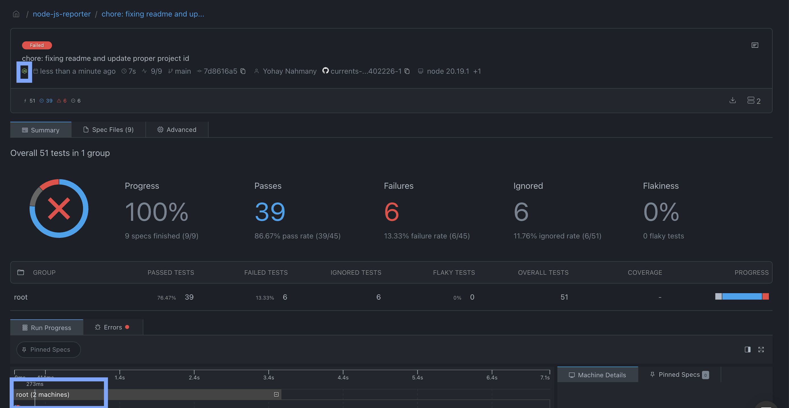

# Currents + Node.js on GitHub Actions Example

## About

This repository demonstrates how to report test results generated by Node.js to [Currents](https://currents.dev) - a cloud platform for debugging, troubleshooting and analyzing CI tests.

## How to reproduce

Follow the steps to reproduce this example:

- Create an account at https://app.currents.dev and obtain Project Id and Record Key
- Save the Record Key as [Repository Secret](https://docs.github.com/en/actions/security-guides/using-secrets-in-github-actions) `CURRENTS_RECORD_KEY`
- Add `@currents/cmd` and `@currents/node-test-reporter` as a dependency
- Configure GitHub actions [workflow](.github/workflows/test.yml):
  - run the tests: `npm run test`
  - convert the results using `npm run convert`
  - upload the test results to Currents: `npx currents upload`

## Resources

- 📖 [Currents documentation](https://docs.currents.dev)
- [`@currents/cmd`](https://docs.currents.dev/resources/reporters/currents-cmd)
- [`@currents/node-test-reporter`](https://docs.currents.dev/resources/reporters/currents-node-test-reporter)

## Currents application example for a run

